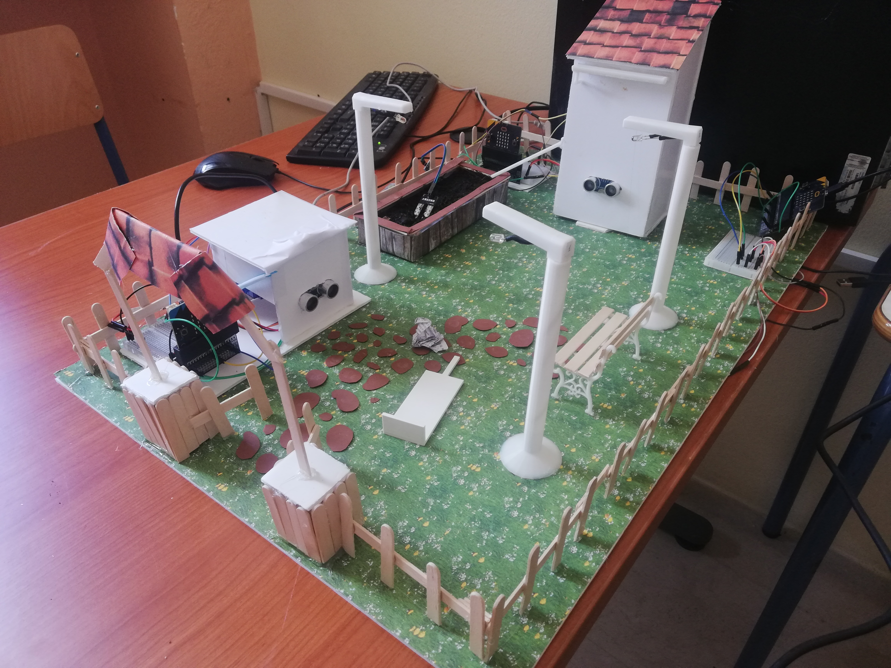

# People & Environment Friendly Park

  

Η ομάδα ρομποτικής του σχολείου μας 5o Λύκειο Αγρινίου προτείνει ένα πάρκο φιλικό τόσο στους ανθρώπους όσο και στο περιβάλλον το οποίο ταυτόχρονα παρέχει και αυτοματισμούς για την ασφάλεια τόσο του ίδιου όσο και των πολιτών.
Για περισσότερη εξοικονόμηση ενέργειας τα φώτα θα ανάβουν αυτόματα το βράδυ, και μόνο όταν είναι κοντά κάποιος. Με το πρώτο φως της ημέρας θα σβήνουν. Μέρος του νερού για το πότισμα των λουλουδιών του πάρκου θα προέρχεται από τη συλλογή της βροχής σε δεξαμενές. Επίσης το πότισμα θα γίνεται με τέτοιο τρόπο ούτως ώστε να επιτυγχάνεται η μεγαλύτερη δυνατή εξοικονόμηση. Στο πάρκο θα υπάρχουν κάδοι ανακύκλωσης οι οποίοι θα ανοίγουν αυτόματα όταν πλησιάζει κάποιος και όταν γεμίσουν θα ειδοποιούν τη κεντρική υπηρεσία του δήμου ότι έχουν γεμίσει. 
  

Υλικά που θα χρειαστούμε :
<ul>
  <li>BBC Micro:bit V2 Board x 2  </li>
  <li>Edge Connector Breakout Board x 2  </li>
  <li>Terminal Block Breakout x 1  </li>
  <li>Πλακέτα Δοκιμών x 4  </li>
  <li>Jumper Wires F-M x 2  </li>
  <li>Jumper Wires 15cm Μ-Μ x 2  </li>
  <li>Ribbon 40wire 20cm - Female to Μale x 2  </li>
  <li>Ribbon 40wire 20cm - Male to Male x 2  </li>
  <li>Street Light for BBC micro:bit x 4  </li>
  <li>Servo (μικρά) x 3  </li>
  <li>Αισθητήρας υγρασίας x 3  </li>
  <li>Ultrasonic Sensor x 2  </li>
  <li>3D Printer Filament x 1  </li>
  <li>Solar Panel x 1  </li>
  <li>Photo Resistor LDR 5mm x 3  </li>
  <li>IR Break Beam Sensor x 3  </li>
  <li>Waveshare Flame Sensor x 3  </li>
</ul>
Ενδεικτικό κόστος 				187€
  
<table style="border: 3px solid; box-shadow: 10px 10px lightblue;">
<caption style="text-align: center;">Εικόνες από τη κατασκευή</caption>
<tbody>
<tr>
	<td colspan="2"></td>
	<td></td>
</tr>
<tr>
	<td colspan="4" align="center"> </td>
</tr>
<tr>
	<td>
</td>
	<td>
</td>
	<td>
</td>
</tr>
</tbody>
</table>
  
([Βίντεο από τη κατασκευή]([https://youtu.be/bPmm7kJnHx](https://youtu.be/C405AnD9Enw)I))

